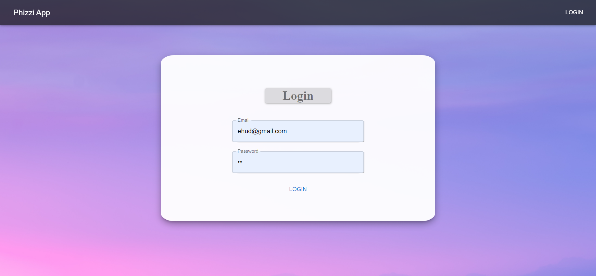
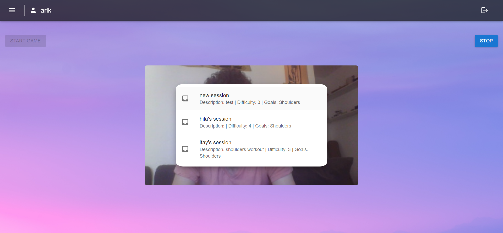
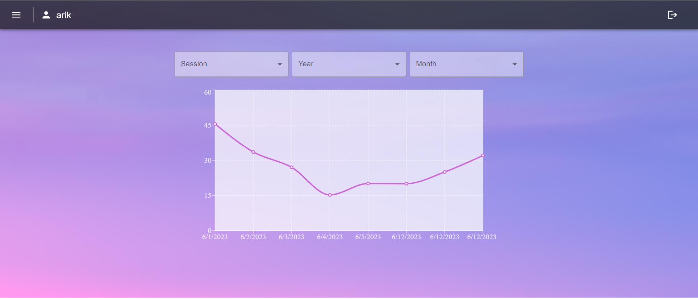
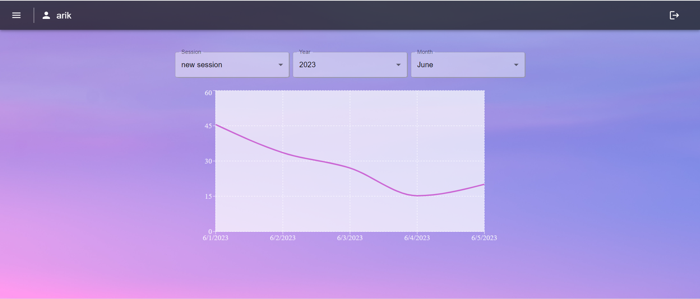
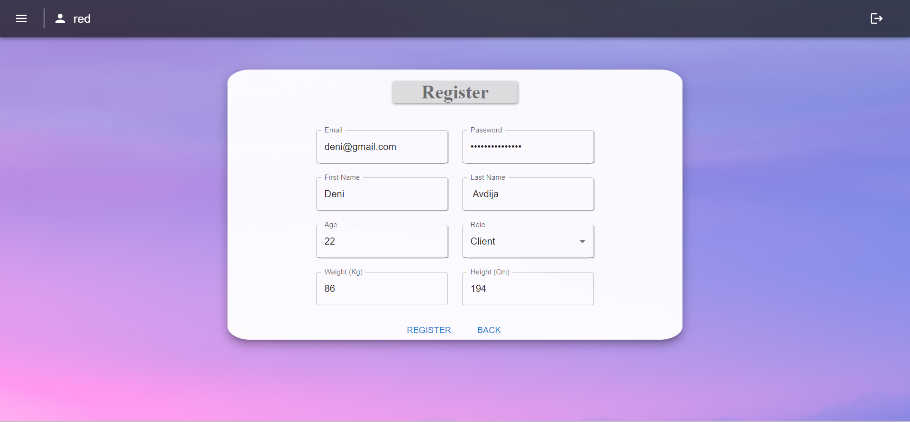
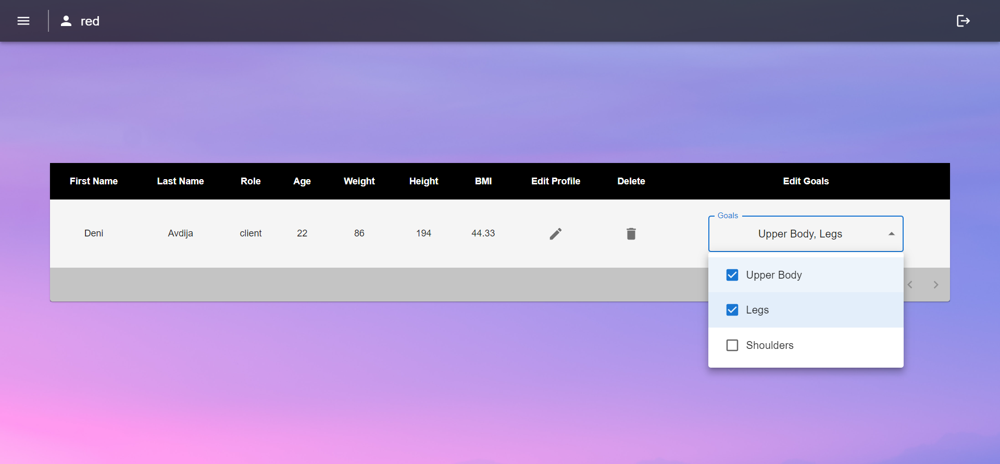
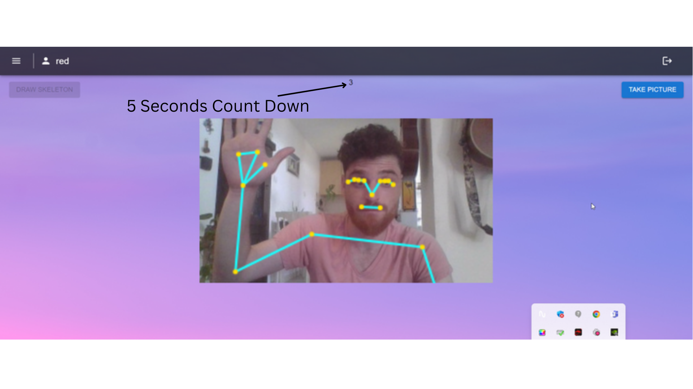
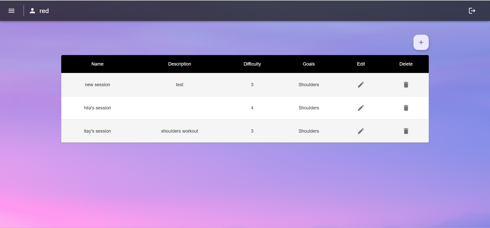
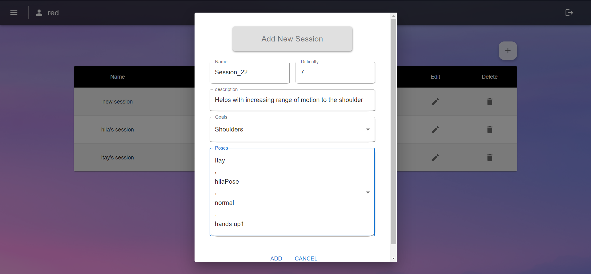
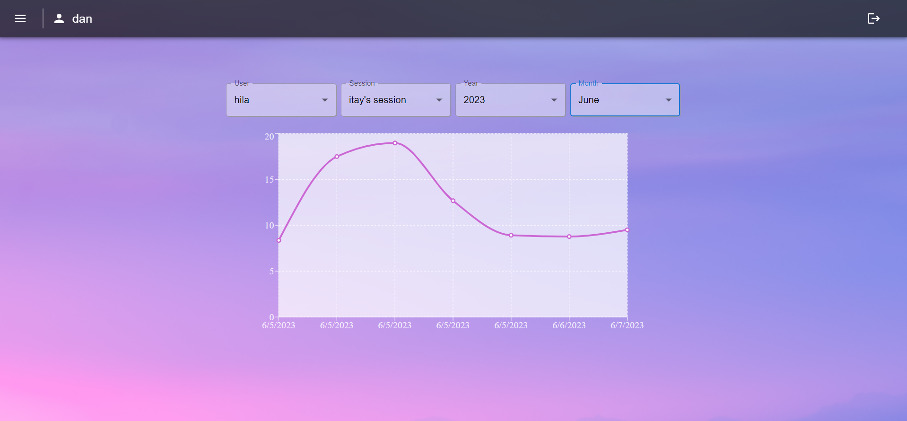

# 
 Phizi User Guide 

## Table of Contents
1. [Introduction](#introduction)
2. [Prerequisite](#prerequisite)
3. [Users](#users)
4. [Actions](#actions)
   * [Patient Actions](#patient-actions)
     - [Play Game](#play-game) 
     - [Progress](#progress)
   * [Therapist Actions](#therapist-actions)
     - [Register](#register)
     - [View Users](#view-users)
     - [Add Pose](#add-pose)
     - [Sessions](#sessions)
     - [Patients Progress](#patients-progress)
5.  [FAQ](#faq)

## Introduction
The Phizzi web app is designed to allow patients, mainly children, to practice their physiotherapy drills at home
in a fun, cheap and easy to use way.  
Our goal is to replace the time-consuming and expensive therapist meetings and the boring drills that are needed to 
be practice at home with a fun game that will keep the child entertained while also practicing his drill, all of that,
at home. 
The web app uses the Blaze Pose neural network and the Media pipeline model to predict, with great accuracy, the user's pose,
the pose is then matched up against known poses from a session assigned by the therapist to a patient.
The results of each session are then saved and the child's parents and therapist can keep track of the patients progress,
allowing for better and more fun treatment.

## Prerequisite
To be able to use the web app:
* Contact one of our therapists and have him register you as a patient under him.
* You will need a laptop or PC (mobile support will come later) with a webcam.
* Login with details given to you be the therapist.
* Set up your machine so that your entire body is in frame when the webcam.
* Allow the browser to access your camera for our site.
And that's it!  

The web app uses the machine GPU so the stronger your GPU the more fps.

## Users
Our system support 3 types of users:
* Patient: the patient is our main user, he is registered by the therapist and is given goals by him. 
* Therapist: the therapist is a user that is known to us at Phizzi it can only be added by an Admin
* Admin: an admin is part of our staff and has the ability to add therapist and to do maintenance work on the app.

## Actions

### App Bar
The app bar is always on the top of any page, it allows for 3 main actions:
* Login - appears on the right of the app bar if the user is not logged in. if pressed it will send you to the login page
* Logout - appears on the right of the app bar if the user is logged in. if pressed it will log out the user from the app
and send him to the welcoming page.
* Menu - appears on the left of the app bar (hamburger menu) opens a menu with all the pages the current logged-in user can
access.

### Login

  
A page to log in to our system with, enter your email in the email box and password in the password box and click
the login button to log in, if successful it will log you in and send you to the welcoming page. 

## Patient Actions
Actions available to a logged in Patient

### Play Game
In the menu press "Play Game" to access this page.    
   
When the page loads you will see the video from your video camera in the center of the screen and on top of that the list 
of all available sessions for you (the sessions are assigned to you based on your assigned goals).  
Once you choose a session your progress in that will be displayed above the video and the first pose for that session
will be displayed in the top left of the video like so:   

   

Once you are read to start the session press the "start game" button, after that a skeleton will be display on top of your
video and the time will start running.
Your Goal is to match the Target position for 2 seconds in order to move on to the next pose, once all the poses in the session are
done you successfully finished the session.   

   

Each matching joint will appear in green and to match the whole pose you have to match every joint with the target pose.
The joints are matched by looking at the angle at the joint and the orientation of that angle so only a good and correct match will
happen.
After the session is over you will be returned to the welcome menu, and you score will be saved.

### Progress
To see your progress as a Patient in the menu click "Progress" and it will send you to the progress page:  

   

The page displays your progress so far. In the center will appear a chart with all of your past sessions, the x-axis is 
the dates and the y-axis is the score. Above the chart you have 3 options to filter by:
* session 
* Year
* Month

you can use these filters to get a more precise graph of your progress like so:   

   

## Therapist Actions

Actions available to a logged in Therapist

### Register
To Register a new patient open the menu and press "Register" and it will send you to the register page.  

   

enter the patient's info into the text boxes and press register to accept or back to cancel. Write down the password
you chose so that you can give it to the patient. 
Once the user is registered you can edit his info and set his goal int the Users page.

### View Users
To view the patients registered by you open the menu and press "Users" and it will send you to the users page.  

   

In this page a table will be displayed and in it all the users registered by you.
you can preform the following actions for each user here: 
* Delete a user
* Set the user's goal or change them
* Edit the user which will send you to a page similar to the register page where you can edit the user's info.

### Add Pose
To add a Pose to the database open the menu and press "Add Pose" and it will send you to the Add Pose Page:  

   

Fill in the pose name and select its goals. After that there are 2 options:
1. Upload a picture - you browse the files on your machine and upload a picture that will then be processed by the
pose matching model.
2. Take a Picture - it will open your webcam and display the video in the center once you press the draw skeleton button
the skeleton will appear on top of your body and the take a picture button will be enabled.
press the take a picture to start a timer of 5 seconds to get into position of the target pose.   

   

when the countdown is done the skeleton will change color, and you can choose to accept it or press the "draw skeleton" 
button to try again.   
   

### Sessions
To Add a new Session or edit an existing one open the menu and press "Sessions" and it will send you to the Sessions page:   

   

Here you can do 3 things:

1. Add a new Session: By clicking the "+" Icon on the top right of the table   

   

Here you chose a name for the session, the difficulty (between 1-10), the goals (select from a list of goals) and the 
poses in the session (multi select from a list of poses matching the goals set by you). the poses will appear by
the order you chose them.

2. Edit an existing Session: By clicking the pencil icon next to a session in the table. 
it will open a page similar to the add Session page where you can edit the session.
3. Delete an existing Session: By clicking the trash can icon next to the session in the table.

### Patients Progress
To view the progress of your patients open the menu and press "Progress" and it will send you to the progress page:   

   

Here you first need to select a user that you wish to view his progress and after that you can filter the:
* session
* Year
* Month  
of each user.
  
### FAQ

#### Q: I tried to log in and nothing happened.
#### A: We at Phizzi use a 'Server less' server so sometimes when a request haven't been made in a while it can take a few moments for the server to respond

#### Q: The skeleton is not showing on top of my video.
#### A: Sometimes the Blaze Pose network encounters an error that we can't handle, please refresh your browser and the issue will be fixed

#### Q: I forgot my password.
#### A: Contact your therapist and ask him for your password.

#### Q: I am a therapist and don't want to upload an image of myself for privacy reasons.
#### A: We don't store the image itself, only the landmarks of the skeleton. your privacy is safe.

#### Q: A session that I was playing with is now not displaying.
#### A: Either your therapist changed your goals or changed the session goals, please contact your therapist to resolve this issue